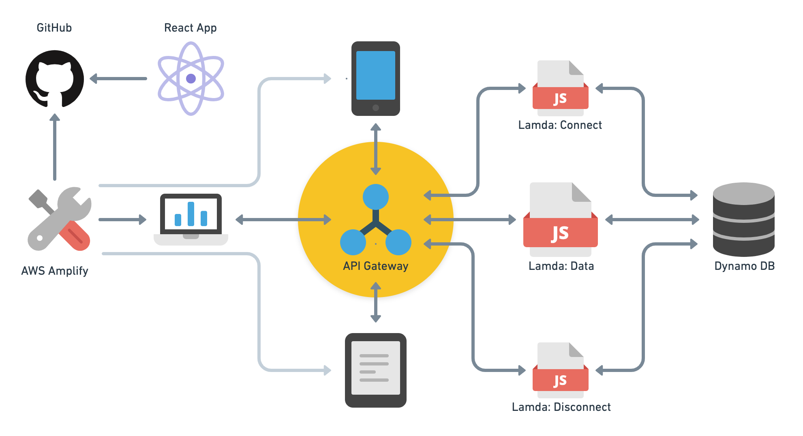
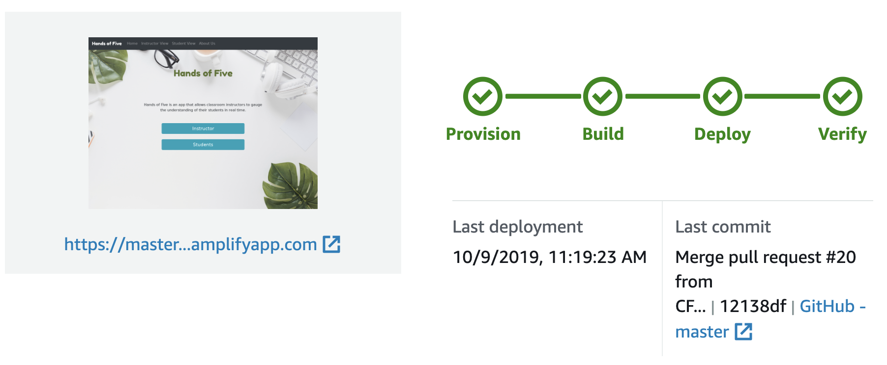

# 401 Java Final Project: Hands of Five

Team members: Travis Cox, Trevor Dobson, Steve Grant, Jane Hur, Renee Messick

Deployed site: https://master.d2681ag10jil74.amplifyapp.com/

## Project overview:

Hands of Five is an app that allows instructors to gauge the understanding of their students in real time. Students are able to share their current level of understanding in an anonynmous way, allowing for more honest feedback.

## Technology/Services used: 

[Online connections diagram](https://whimsical.com/JhrDEJM1ed3ufaDECLaqYo)

### React

Our front end is a built as a [React](https://reactjs.org/) app. An instructor is able to post a question which students can respond to. Data is sent and received by the front end through an API Gateway Websocket connection. Results are updated and displayed in real-time! 

Also used in our frontend: 

- [ReactBootstrap](https://react-bootstrap.github.io/) 
- [Chart.js](https://www.chartjs.org/docs/latest/)
- [react-chartjs-2](https://www.npmjs.com/package/react-chartjs-2) 

### GitHub

[GitHub](https://github.com/) was used to manage our code and to document our project: 

- [Repo for Project Documentation](https://github.com/CF-401-Final/cf-401-final)
- [Repo for Frontend](https://github.com/CF-401-Final/frontend)
- [Repo for Lambda Functions](https://github.com/CF-401-Final/hands-lambda)

### AWS Amplify

We used an AWS service called [Amplify](https://aws.amazon.com/amplify/) to automate the build and deployment of our frontend. Amplify was integrated with one of our GitHub repos, so that updates to master would automatically start a process to build and publish our React app. 

### AWS API Gateway Websockets

Using WebSocket APIs in AWS's [API Gateway](https://aws.amazon.com/api-gateway/), we were able to create a two-way connection between users and our backend. This allows messages to be sent and received in real time without the client explicitly making requests. In our app, we use this connection to allow students to submit responses which are then manipulated and displayed on the frontend in immediately.

This [tutorial](https://aws.amazon.com/blogs/compute/announcing-websocket-apis-in-amazon-api-gateway/) allowed us to make the basic connections for our app. 

### AWS Lambda Functions
- [Connect](https://github.com/CF-401-Final/hands-lambda/blob/master/connect.js): When a new client connects to the API, their connection ID is added to a DynamoDB. 
- [Send/Receive Data](https://github.com/CF-401-Final/hands-lambda/blob/master/sendVote.js): This Lambda function is invoked when clients submit responses. Responses are saved in a DynamoDB and updated results are then sent to all connected clients, which can be seen through the data displayed on screen.
- [Disconnect](https://github.com/CF-401-Final/hands-lambda/blob/master/disconnect.js): Removes the record corresponding with the specified connectionId value in DynamoDB.

### DynamoDB

[DynamoDB](https://aws.amazon.com/dynamodb/) is used to keep track each of the connected clients and any data they submit through the frontend. 

## Project documentation

- [Wireframes](https://whimsical.com/Nc2w7CeyFZ73DDXcEMqgTB#2Ux7TurymNB6r2PosD1R)
- [Team Agreement](projectDocs/TeamAgreement.md)
- [Conflict Plan](projectDocs/conflictPlan.md)
- [Trello Board](https://trello.com/b/Rm0s1xSj/cf-401-final)
- [ER Diagram](Soon!)
- [User Stories](projectDocs/userStories.md)
- [Domain Modeling](projectDocs/domainModel.md)

