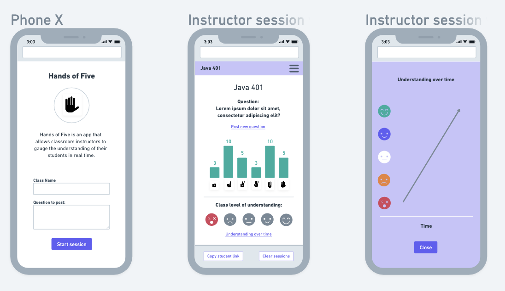

# cf-401-final

Team members: Travis Cox, Trevor Dobson, Steve Grant, Jane Hur, Renee Messick

Deployed site: Coming Soon!

Presentation deck: Coming Soon!

## Project overview:

Hands of Five is an app that allows instructors to gauge the understanding of their students in real time. Students are able to share their current level of understanding in an anonynmous way, allowing for more honest feedback.

### Project documentation

[Wireframes](https://whimsical.com/Nc2w7CeyFZ73DDXcEMqgTB#2Ux7TurymNB6r2PosD1R)

Coming soon!

---

- [User stories](coming soon)
- [Team Agreement](projectDocs/TeamAgreement.md)
- [Conflict Plan](projectDocs/conflictPlan.md)
- [Trello Board](https://trello.com/b/Rm0s1xSj/cf-401-final)
- [ER Diagram](Soon!)
- [User Stories](projectDocs/userStories.md)

## Screenshots

## Resources:
